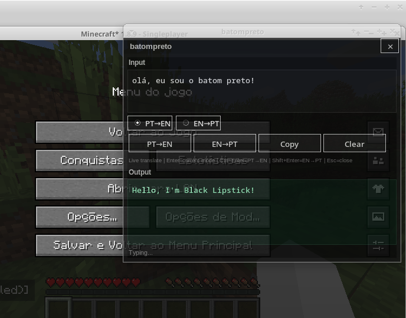
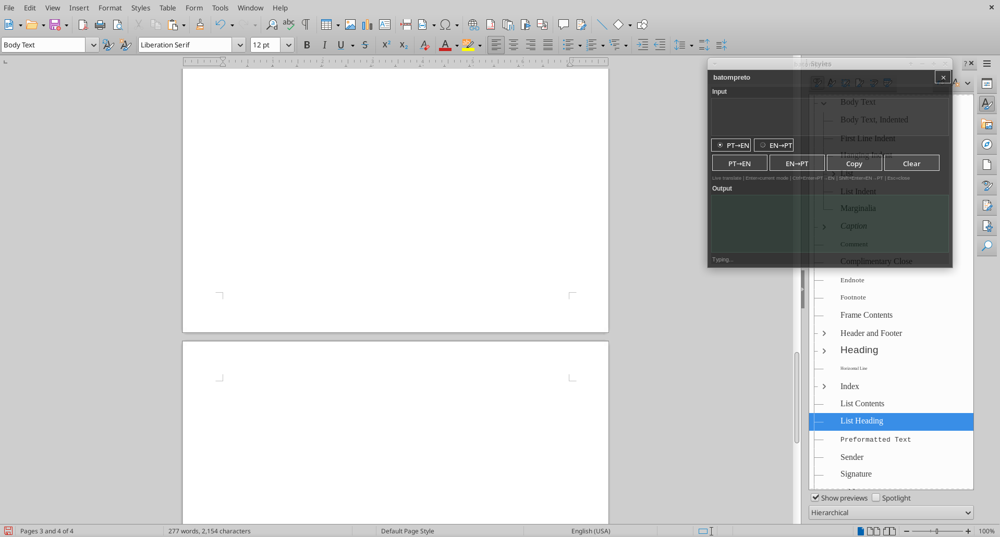

# BatomPreto 🐈‍⬛

Real-time translator overlay for productivity and gaming.

Tradutor em tempo real com overlay leve para produtividade e jogos.

---

## Badges


---

##  Features / Funcionalidades

- Real-time translation while typing  
- Lightweight overlay interface  
- Designed for multitasking (gaming + work)  
- Focused on usability and simplicity  

- Tradução em tempo real enquanto digita  
- Interface leve com overlay  
- Pensado para multitarefa (jogos + trabalho)  
- Foco em simplicidade e usabilidade  

---

##  Screenshots




---

## Installation / Instalação

- Fedora (Recommended) / Fedora (Recomendado)

#### Dependencies / Dependências

```bash
sudo dnf install python3 python3-tkinter crow-translate
```
Install using RPM / Instale usando RPM:
```bash
sudo dnf install ./batompreto-1.1.0-1.fc42.x86_64.rpm
```

This is the recommended and fully tested installation method.
Este é o método recomendado e totalmente testado.

### Linux Portable (Experimental) / Linux Portátil (Experimental)

```bash
unzip batompreto-linux-portable.zip
cd dist/batompreto
./batompreto
```

If it does not work, use the RPM version.
Se não funcionar, utilize a versão RPM.


### Usage / Uso

Run:
```bash
batompreto
```

### Status

This project is currently under active development.
Este projeto está em desenvolvimento ativo.


### About / Sobre

BatomPreto was originally created for personal use, focused on improving real-time communication while gaming and working.
Inicialmente foi criado para uso pessoal, com foco em melhorar a comunicação em tempo real durante jogos e trabalho.
I decided to continue developing and sharing it because I believe in open source and collaborative improvement.
Decidi continuar desenvolvendo e compartilhar o projeto porque acredito no open source e na evolução colaborativa.

### Contributing

Contributions are welcome.
Contribuições são bem-vindas.

### License
MIT License


